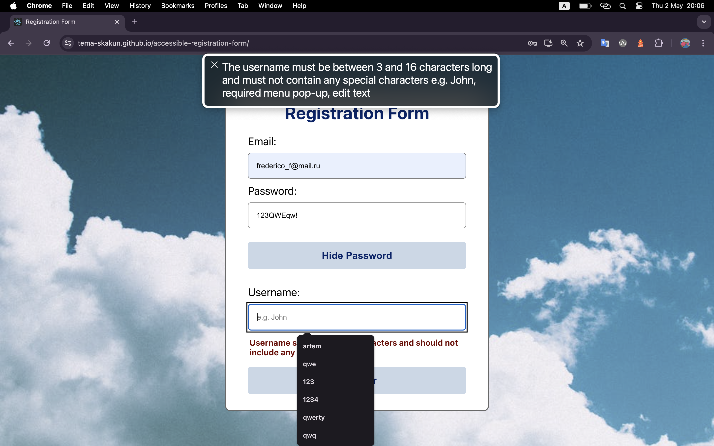
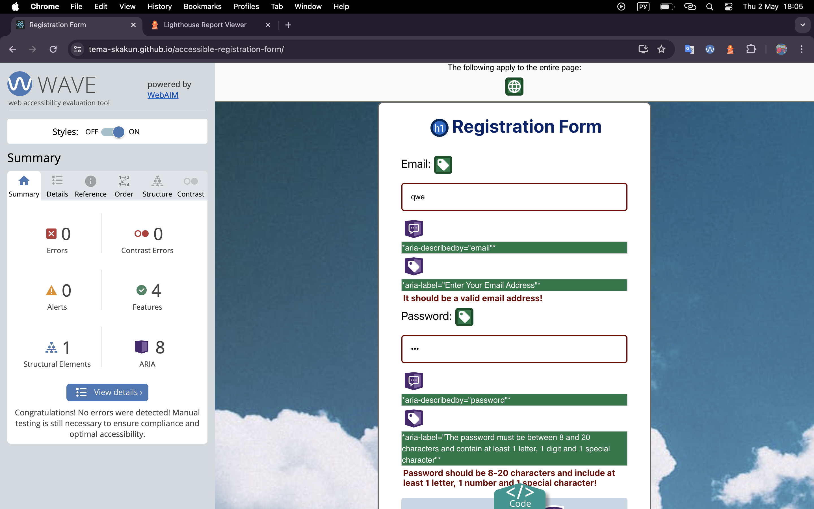
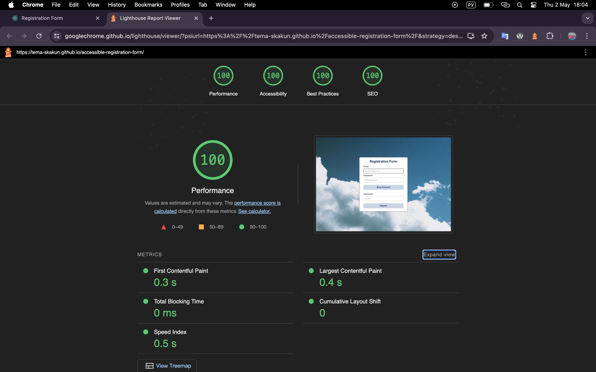

# Accessible Registration Form
Welcome to the repository dedicated to the development of an accessible registration form designed to meet the requirements of the Web Content Accessibility Guidelines (WCAG). This project ensures that the registration process is inclusive and usable for all individuals, including those using assistive technologies such as screen readers.

Throughout this repository, you'll find detailed documentation outlining the task at hand, the resources consulted, and the tools utilized for testing. Additionally, there's a comprehensive overview of the solution implemented to enhance accessibility and suggestions for further improvements.

## Table of Contents

* [Overview of Qodana](#overview-of-qodana)
* [Task](#task)
* [Tools](#tools)
* [Tools test results](#tools-test-results)
* [What can be added](#what-can-be-added)
* [Deployment](#deployment)
* [Resources](#resources)

## Overview of Qodana
Static code analysis by Qodana helps development teams follow agreed quality standards, and deliver readable, maintainable, and secure code. Powered by JetBrains.

[Qodana Code Quality Platform – Overview](https://www.youtube.com/watch?v=WrhnUnzMUCg&ab_channel=JetBrains)

## Task
Accessibility Enhancements for Qodana Reports
Design and develop an accessible registration form with fields for email, password, and username,
plus a "Show Password" toggle button, ensuring keyboard navigability and screen reader compatibility.

## Tools
 ### Screen Readers

VoiceOver (Mac OS) - works successfully.

    - ___ (Windows OS)
    - ___ (Linux OS)
 ### Accessibility Testing Tools
    - WAVE Web Accessibility Evaluation Tools (+)
    - Lighthouse (+)

## Tools test results

There are no errors, issues and alerts in the report from WAVE.

In Lighthouse's report, all ratings are equal to 100.

## What can be added
    - проверка пароля и вывод сообщения о несоответствии/соответствии для каждого поля
    - общая проверка формы
    - добавить aria-live="polite" для сообщений об ошибках

~~СДЕЛАТЬ диплой~~ и потестить на ридерах линуксе и винде; ~~и в лайтхаусе~~
перевести ридми на английский
написать заключение

## Deployment
Вы можете потестировать моё приложение по ссылке
[link](https://tema-skakun.github.io/accessible-registration-form/)

## Resources
### What did I read
[Web Content Accessibility Guidelines (WCAG) 2.1](https://www.w3.org/TR/WCAG21/#toc)

[WCAG 2.1 Checklist with Code Examples](https://www.accessi.org/blog/wcag-checklist-with-code-examples/)

### What did I watch
[Basic of HTML](https://www.youtube.com/watch?v=_J6hMLsscOo&t=6277s&ab_channel=webDev)

[How I do an accessibility check](https://www.youtube.com/watch?v=cOmehxAU_4s&t=723s&ab_channel=ChromeforDevelopers)

[Accessible Web Design: What Is It & How To Do It](https://www.youtube.com/watch?v=-ao_Kc_8rpE&t=21s&ab_channel=FluxAcademy)

[UX Design for Accessibility: Accessibility Design Best Practices](https://www.youtube.com/watch?v=rJLWbG-K0Z8&ab_channel=AppianCommunity)

[How to make accessible forms - with lots of examples!](https://www.youtube.com/watch?v=ffxwEyBcdf0&t=828s&ab_channel=Silktide)

[Testing Web Pages for Web Accessibility Part 1](https://www.youtube.com/watch?v=DgFXUx2QwB0&t=1363s&ab_channel=AfricaKenyah)

[Web Content Accessibility Guidelines (WCAG 2.1) Crash Course](https://www.youtube.com/watch?v=NEK3aMPs1Us&t=2547s&ab_channel=AfricaKenyah)

[Registration Process: AccessAbility Services](https://www.youtube.com/watch?v=KG532yZnLZQ&t=13s&ab_channel=AccessAbilityServices)

[WCAG - Web Content Accessibility Guidelines 2.1 Explained](https://www.youtube.com/watch?v=Hi3tQ_HzOgo&ab_channel=Intellipaat)

[How to make your login forms accessible (according to WCAG 2.2)](https://www.youtube.com/watch?v=E66_O0JpThI&ab_channel=Silktide)

### Useful resources
Website ["Can I use"](https://caniuse.com/?search=htmlFor) provides up-to-date browser support tables for support of front-end web technologies on desktop and mobile web browsers.

[MDN Web Docs](https://developer.mozilla.org/en-US/docs/Web/Accessibility/ARIA) is an open-source, collaborative project documenting Web platform technologies, including CSS, HTML, JavaScript, and Web APIs.
