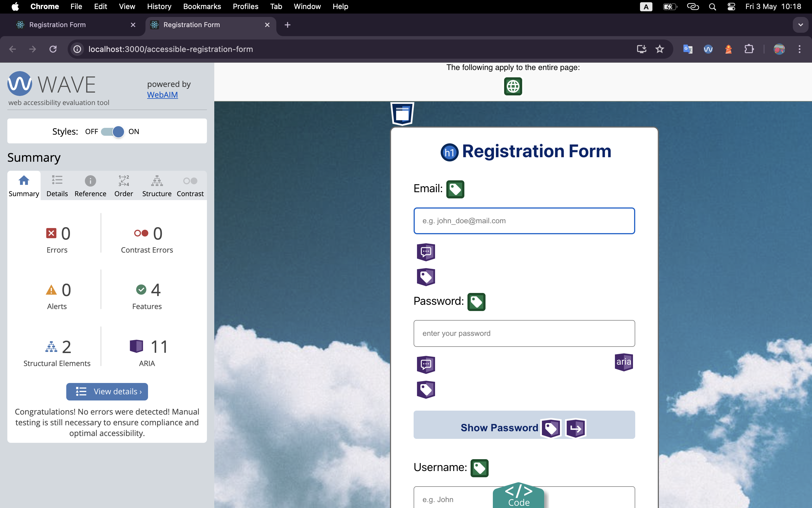

# Accessible Registration Form
Welcome to the repository dedicated to the development of an accessible registration form designed to meet the requirements of the Web Content Accessibility Guidelines (WCAG). This project ensures that the registration process is inclusive and usable for all individuals, including those using assistive technologies such as screen readers.

Throughout this repository, you'll find detailed documentation outlining the task at hand, the resources consulted, and the tools utilized for testing. Additionally, there's a comprehensive overview of the solution implemented to enhance accessibility and suggestions for further improvements.

## Table of Contents

* [Overview of Qodana](#overview-of-qodana)
* [Task](#task)
* [Tools](#tools)
* [Tools test results](#tools-test-results)
* [What can be added](#what-can-be-added)
* [Deployment](#deployment)
* [Conclusion](#conclusion)
* [Resources](#resources)

## Overview of Qodana
Static code analysis by Qodana helps development teams follow agreed quality standards, and deliver readable, maintainable, and secure code. Powered by JetBrains.

[Qodana Code Quality Platform – Overview](https://www.youtube.com/watch?v=WrhnUnzMUCg&ab_channel=JetBrains)

## Task
Accessibility Enhancements for Qodana Reports
Design and develop an accessible registration form with fields for email, password, and username,
plus a "Show Password" toggle button, ensuring keyboard navigability and screen reader compatibility.

## Tools
I used three browsers, three screen readers and three accessibility testing tools.

### Browsers
+ Mozilla Firefox [Version 125.0.3 (64-bit)]
+ Google Chrome [Version 124.0.6367.119 (Official Build) (x86_64)]
+ Safari [Version 17.4.1 (19618.1.15.11.14)]

### Screen Readers

VoiceOver (macOS) - works successfully.

Narrator (Windows OS) - works successfully.

Orca Screen Reader (Linux OS)

### Accessibility Testing Tools
+ WAVE Web Accessibility Evaluation Tools
+ Lighthouse
+ axe DevTools - Web Accessibility Testing

## Tools test results

I am facing a problem with the Safari browser. The focus does not go to the buttons when moving around the page using the tab button.

Solution - I added the `tabindex="0"` attribute to the buttons.

There are no errors, issues and alerts in the report from WAVE.

In Lighthouse's report, all ratings are equal to 100.

There are no issues in the Axe DevTool report.

## Manual testing

+   Interactive controls are keyboard focusable
+   Interactive elements indicate their purpose and state
+   The page has a logical tab order
+   Visual order on the page follows DOM order
+   User focus is not accidentally trapped in a region
+   The user's focus is directed to new content added to the page
+   HTML5 landmark elements are used to improve navigation
+   Offscreen content is hidden from assistive technology
+   Custom controls have associated labels
+   Custom controls have ARIA roles

## What can be added
+ check the password and to display compliance / non-compliance messages for each condition
+ add a general form check
+ add `aria-live="polite"` for each error messages

## Deployment
You can test my application using the [link](https://tema-skakun.github.io/accessible-registration-form/)

## Conclusion

During this project, I developed a registration form using the React library. This form provides usability for users with disabilities by WCAG requirements. Special attention was paid to the ability to scale the solution quickly, allowing new fields to be added to the form.

After development, I thoroughly tested the form on screen readers across three operating systems and three browsers. Automated accessibility testing was also performed using three different tools. Additionally, manual testing was performed.

As a result of this project, I achieved a significant milestone-full compliance with accessibility and usability requirements for all users, including those with disabilities. This accomplishment ensures that a wide range of users can access the form's functionality.

Working on this project has been a great pleasure, and I am very enthusiastic about continuing to develop and create accessible and user-friendly interfaces. It will be a great honor for me to participate in improving the accessibility of the Qodana project. Willingness for further cooperation and commitment to professional growth are the basis of my work in this area.

## Resources
### What did I read
[Web Content Accessibility Guidelines (WCAG) 2.1](https://www.w3.org/TR/WCAG21/#toc)

[WCAG 2.1 Checklist with Code Examples](https://www.accessi.org/blog/wcag-checklist-with-code-examples/)

### What did I watch
[Basic of HTML](https://www.youtube.com/watch?v=_J6hMLsscOo&t=6277s&ab_channel=webDev)

[How I do an accessibility check](https://www.youtube.com/watch?v=cOmehxAU_4s&t=723s&ab_channel=ChromeforDevelopers)

[Accessible Web Design: What Is It & How To Do It](https://www.youtube.com/watch?v=-ao_Kc_8rpE&t=21s&ab_channel=FluxAcademy)

[UX Design for Accessibility: Accessibility Design Best Practices](https://www.youtube.com/watch?v=rJLWbG-K0Z8&ab_channel=AppianCommunity)

[How to make accessible forms - with lots of examples!](https://www.youtube.com/watch?v=ffxwEyBcdf0&t=828s&ab_channel=Silktide)

[Testing Web Pages for Web Accessibility Part 1](https://www.youtube.com/watch?v=DgFXUx2QwB0&t=1363s&ab_channel=AfricaKenyah)

[Web Content Accessibility Guidelines (WCAG 2.1) Crash Course](https://www.youtube.com/watch?v=NEK3aMPs1Us&t=2547s&ab_channel=AfricaKenyah)

[Registration Process: AccessAbility Services](https://www.youtube.com/watch?v=KG532yZnLZQ&t=13s&ab_channel=AccessAbilityServices)

[WCAG - Web Content Accessibility Guidelines 2.1 Explained](https://www.youtube.com/watch?v=Hi3tQ_HzOgo&ab_channel=Intellipaat)

[How to make your login forms accessible (according to WCAG 2.2)](https://www.youtube.com/watch?v=E66_O0JpThI&ab_channel=Silktide)

### Useful resources
Website ["Can I use"](https://caniuse.com/?search=htmlFor) provides up-to-date browser support tables for support of front-end web technologies on desktop and mobile web browsers.

[MDN Web Docs](https://developer.mozilla.org/en-US/docs/Web/Accessibility/ARIA) is an open-source, collaborative project documenting Web platform technologies, including CSS, HTML, JavaScript, and Web APIs.

[axe-core](https://github.com/dequelabs/axe-core?tab=readme-ov-file) is an accessibility testing engine for websites and other HTML-based user interfaces. It's fast, secure, lightweight, and was built to seamlessly integrate with any existing test environment so you can automate accessibility testing alongside your regular functional testing.
